# FinPremium — Documentação Completa do App

> Infoproduto de finanças pessoais com estética **premium dark** (dourado + obsidiana).  
> Stack local rodando em `http://127.0.0.1:3000` (frontend) + `http://127.0.0.1:8000` (API).  
> Repositório: [wesleynb10/Testes](https://github.com/wesleynb10/Testes) · Versão documentada: **v1.5**

---

## Sumário

1. [Visão geral](#1-visão-geral)
2. [Arquitetura e stack](#2-arquitetura-e-stack)
3. [Como rodar local](#3-como-rodar-local)
4. [Mapa de rotas (todas as telas)](#4-mapa-de-rotas-todas-as-telas)
5. [Telas do produto (prints)](#5-telas-do-produto-prints)
6. [Funil de vendas e monetização](#6-funil-de-vendas-e-monetização)
7. [Painel admin (prints)](#7-painel-admin-prints)
8. [Sequência de e-mails (drip)](#8-sequência-de-e-mails-drip)
9. [API backend](#9-api-backend)
10. [Design system](#10-design-system)
11. [Dados e persistência](#11-dados-e-persistência)
12. [Variáveis de ambiente](#12-variáveis-de-ambiente)
13. [Credenciais locais](#13-credenciais-locais)
14. [Status das integrações](#14-status-das-integrações)
15. [Histórico de versões](#15-histórico-de-versões)

---

## 1. Visão geral

O **FinPremium (Wealth OS)** é um protótipo completo de infoproduto financeiro com:

| Camada | O que faz |
|--------|-----------|
| **App do comprador** | Dashboard, orçamento 50/30/20, dívidas, metas FIRE, bônus, escopo |
| **Lead magnet** | Calculadora pública de juros compostos (`/calculadora`) |
| **Vendas** | Landing `/venda` + checkout Stripe + página `/obrigado` |
| **Admin** | Login JWT, KPIs, leads, vendas, fila de drip |
| **Automação** | 5 e-mails de nutrição pós-lead (dias 1, 3, 5, 9, 14) |

Público-alvo: 25–45 anos, CLT/autônomo, R$ 3–15k/mês, tráfego pago Meta/Instagram.

---

## 2. Arquitetura e stack

```
┌─────────────────┐     cookies JWT      ┌──────────────────┐
│  React (CRA)    │ ◄──────────────────► │  FastAPI         │
│  :3000          │   REST /api/*        │  :8000           │
│  Tailwind+shadcn│                      │  drip worker 60s │
└─────────────────┘                      └────────┬─────────┘
                                                  │
                                         ┌────────▼─────────┐
                                         │  MongoDB :27017  │
                                         │  DB: finpremium  │
                                         └──────────────────┘
```

| Parte | Tecnologia |
|-------|------------|
| Frontend | React 19, React Router 7, CRACO, Tailwind 3, Recharts, jsPDF, Framer Motion, Lucide |
| Backend | FastAPI 0.110, Uvicorn, Motor/PyMongo, JWT (PyJWT), bcrypt, Resend, Stripe (via integração) |
| Banco | MongoDB 8 |
| Design | Fraunces (display) + Manrope (body), dark premium |

Pastas principais:

```
Testes/
├── frontend/          # App React
├── backend/           # API FastAPI + drip + auth + e-mail
├── memory/PRD.md      # Histórico de produto
├── FinPremium_Escopo_Completo.md
└── docs/              # Esta documentação + screenshots/
```

---

## 3. Como rodar local

```bash
# Mongo (se ainda não estiver up)
mongod --dbpath ./data/db --port 27017 --bind_ip 127.0.0.1

# Backend
cd backend
source .venv/bin/activate
uvicorn server:app --host 127.0.0.1 --port 8000 --reload

# Frontend
cd frontend
npm start   # HOST=127.0.0.1 PORT=3000
```

- App: http://127.0.0.1:3000  
- API docs: http://127.0.0.1:8000/docs  

---

## 4. Mapa de rotas (todas as telas)

| Rota | Tipo | Descrição |
|------|------|-----------|
| `/` | App (sidebar) | Dashboard executivo |
| `/orcamento` | App | Orçamento 50/30/20 + import CSV |
| `/dividas` | App | Dívidas + Snowball/Avalanche |
| `/metas` | App | Metas + Número da Liberdade (FIRE) |
| `/bonus` | App | 6 bônus premium + CTA venda |
| `/escopo` | App | Escopo do produto (MD/PDF) |
| `/calculadora` | Pública | Lead magnet juros compostos |
| `/venda` | Pública | Landing de vendas + pacotes |
| `/obrigado` | Pública | Pós-checkout (polling Stripe) |
| `/admin/login` | Admin | Login JWT |
| `/admin` | Admin | Visão geral / Leads / Vendas / Drip |

---

## 5. Telas do produto (prints)

### 5.1 Dashboard — `/`

Painel executivo do mês: KPIs (receita, gastos, investido, saldo), gráficos, regra 50/30/20, alertas, Número da Liberdade e botão **Compartilhar Story** (PNG Instagram 1080×1920).

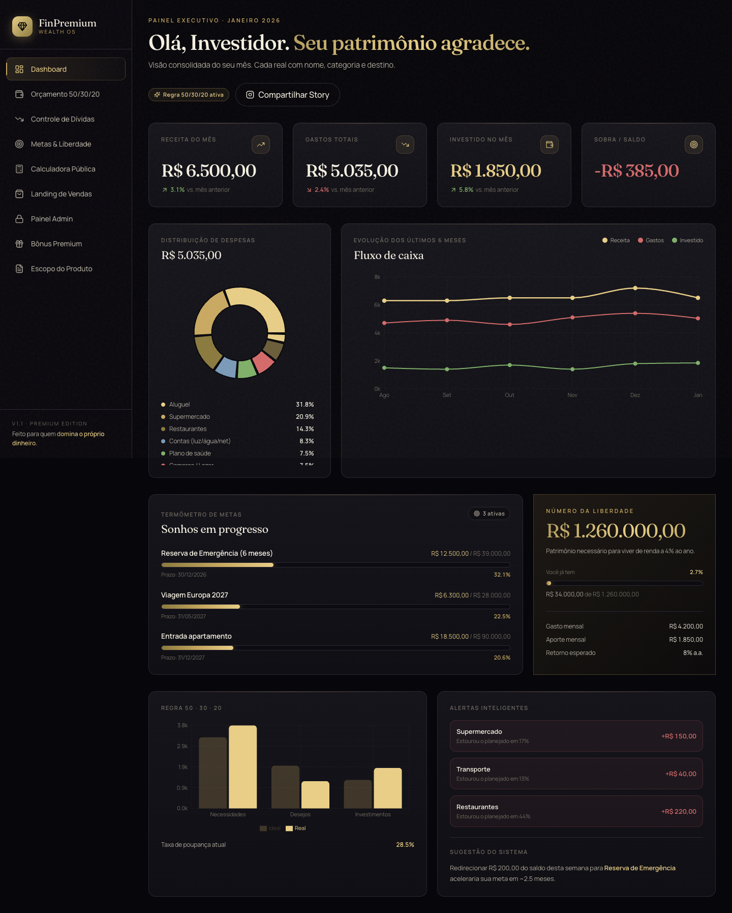

---

### 5.2 Orçamento 50/30/20 — `/orcamento`

Tabela editável Necessidades / Desejos / Investimentos (planejado × real). Importação de CSV de extrato (Nubank, Itaú, Bradesco, Santander, Inter, C6) com auto-categorização.

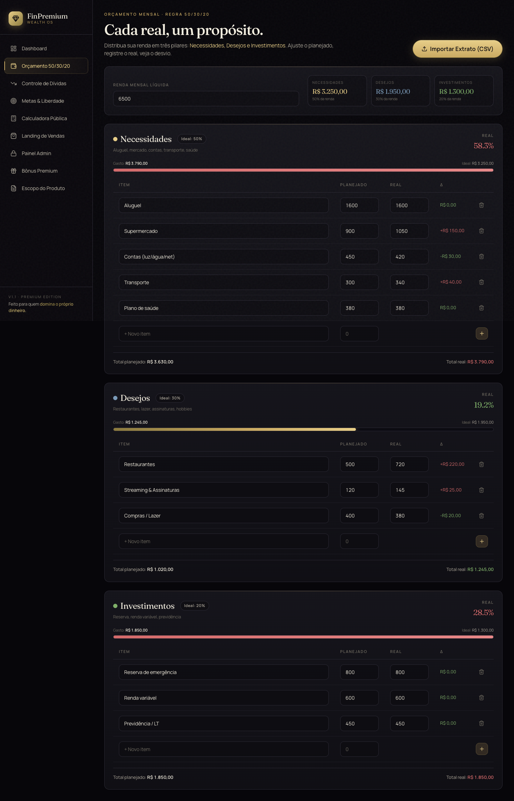

---

### 5.3 Controle de Dívidas — `/dividas`

Cadastro de dívidas + simulador **Bola de Neve** (menor saldo) ou **Avalanche** (maior taxa), com aporte extra e ordem de ataque.

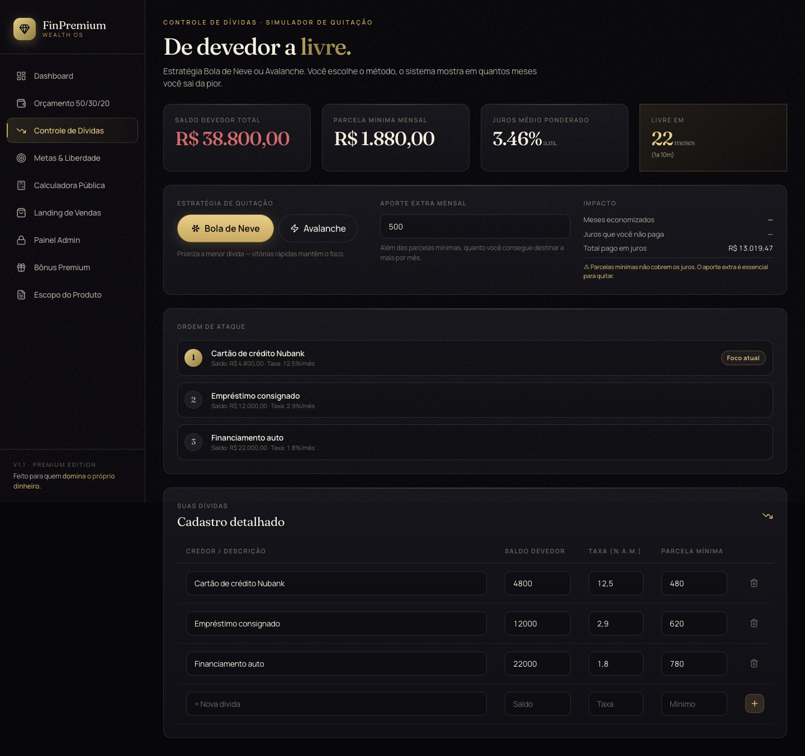

---

### 5.4 Metas & Liberdade — `/metas`

Metas com progresso + calculadora FIRE (regra dos 4%):  
`Número_Liberdade = (Gasto_Mensal × 12) / 0,04`

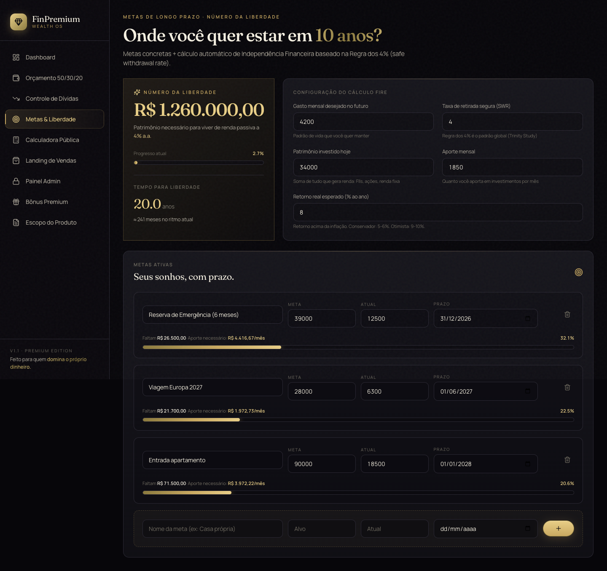

---

### 5.5 Calculadora pública (lead magnet) — `/calculadora`

Simulador de juros compostos sem sidebar. Captura e-mail → `POST /api/leads` (MongoDB) + agenda drip de 5 e-mails + notifica owner (se Resend configurado).

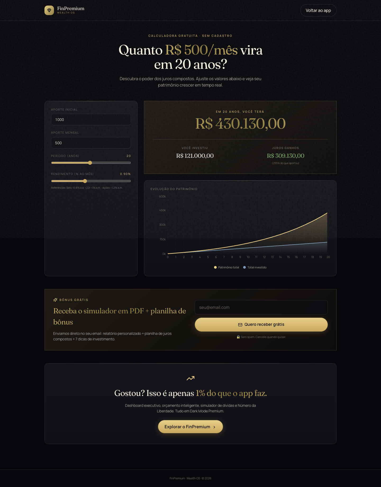

---

### 5.6 Landing de vendas — `/venda`

Hero, dores, solução, depoimentos, bônus, urgência 48h, FAQ e **3 pacotes**:

| Pacote | Preço | Conteúdo |
|--------|-------|----------|
| Starter | R$ 47 | Planilha + 3 bônus |
| Completo | R$ 97 | Planilha + 6 bônus + comunidade (destaque) |
| Plus + Mentoria | R$ 297 | Tudo + mentoria mensal |


---

### 5.7 Página de obrigado — `/obrigado`

Após checkout: polling do status Stripe (`/api/checkout/status/{session_id}`) até 8× / 2s. Estados: checking → paid / pending / expired / error.

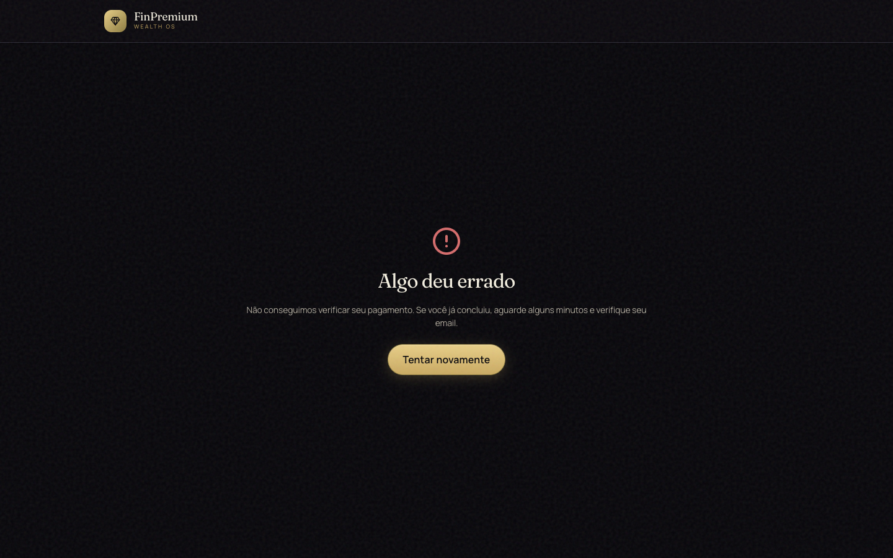

---

### 5.8 Bônus Premium — `/bonus`

Cards dos 6 bônus; CTA leva para `/venda`.

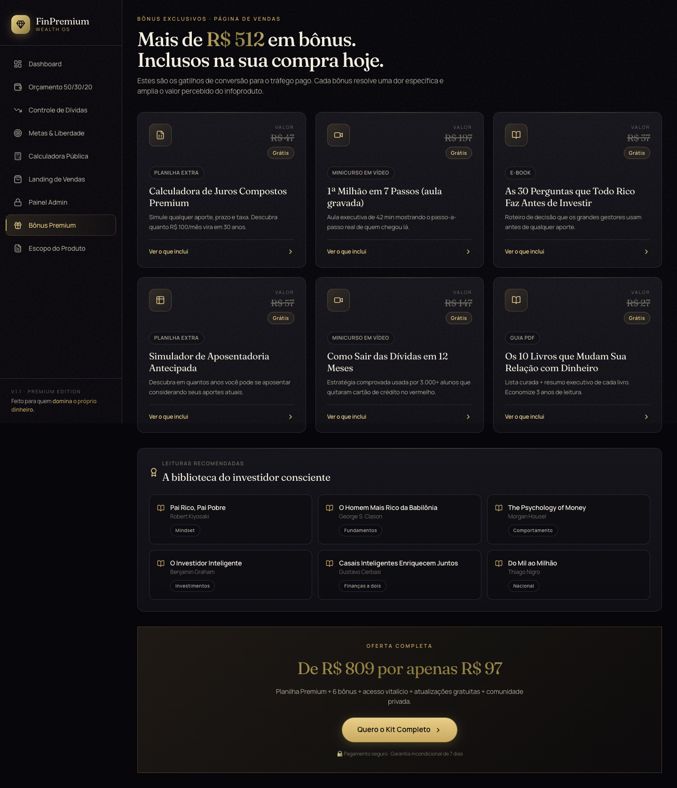

---

### 5.9 Escopo do produto — `/escopo`

Documento de escopo no app, com download MD/PDF.

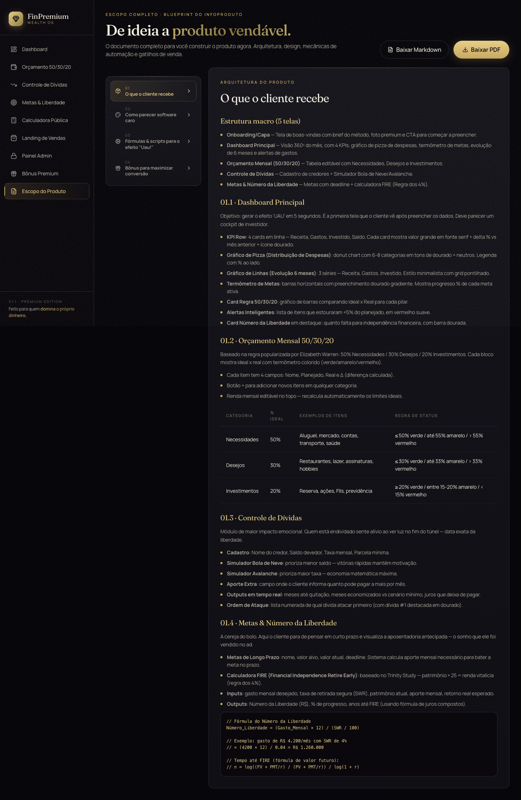

---

## 6. Funil de vendas e monetização

```
Tráfego pago → /calculadora (lead)
                    ↓
              drip 5 e-mails
                    ↓
              /venda (checkout)
                    ↓
              Stripe → /obrigado
                    ↓
         e-mail boas-vindas + cancela drip
```

- Preços **sempre server-side** em `PACKAGES` (`backend/server.py`) — o frontend nunca manda `amount`.
- Webhook: `POST /api/webhook/stripe`.

---

## 7. Painel admin (prints)

### 7.1 Login — `/admin/login`

JWT em cookies HttpOnly (access 12h + refresh 30d). Proteção brute-force: 5 falhas → lock 15 min.


---

### 7.2 Visão geral — `/admin`

4 KPIs: Receita total, Leads, Conversão, Ticket médio. Listas dos últimos leads e vendas.

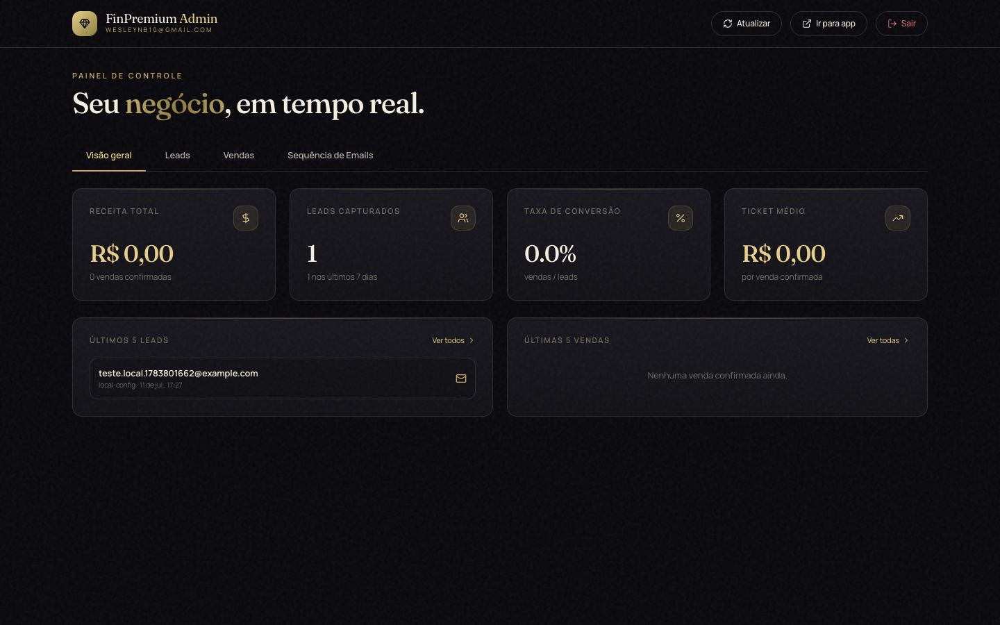

---

### 7.3 Leads

Tabela: e-mail, origem, metadados da simulação, data.

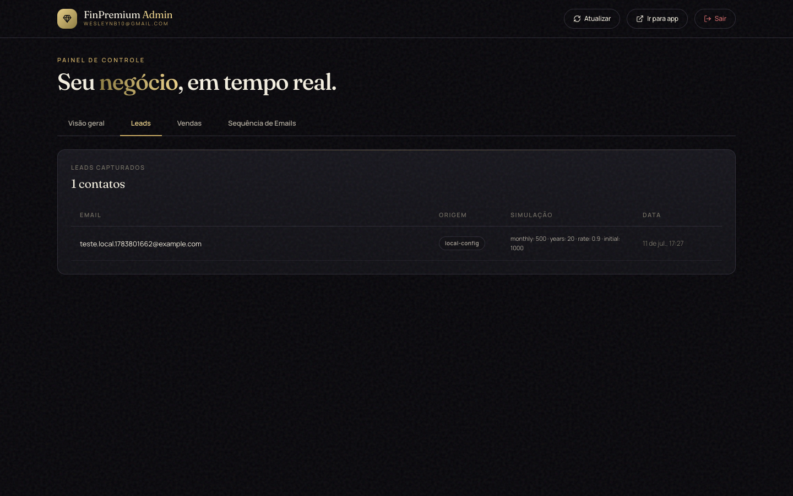

---

### 7.4 Vendas

Transações Stripe (pending / paid / etc.).

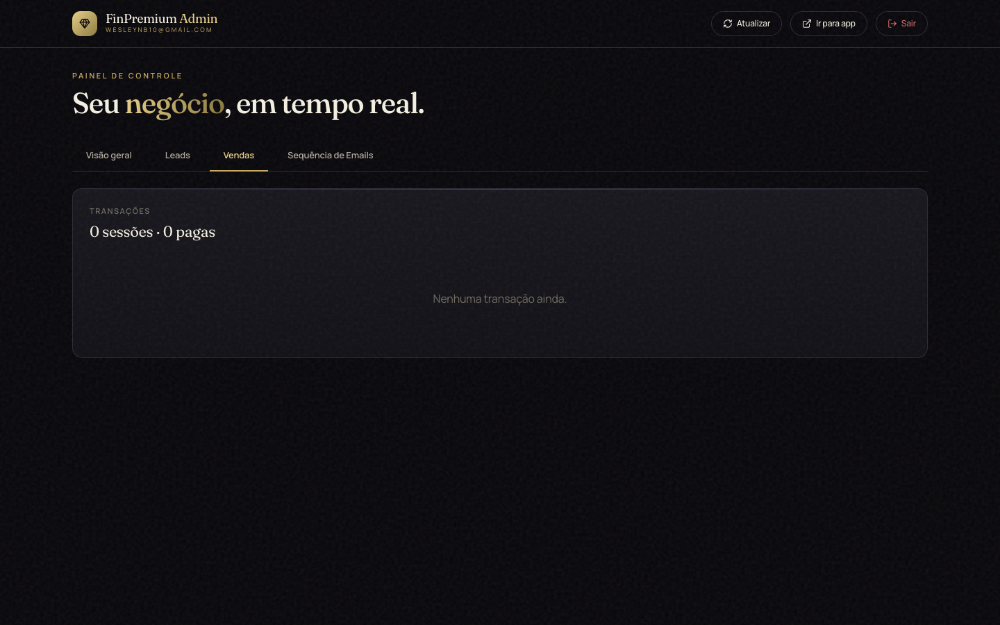

---

### 7.5 Sequência de e-mails (drip)

KPIs Agendados / Enviados / Cancelados / Falhas + fila com **Enviar agora** e **Verificar fila agora**.

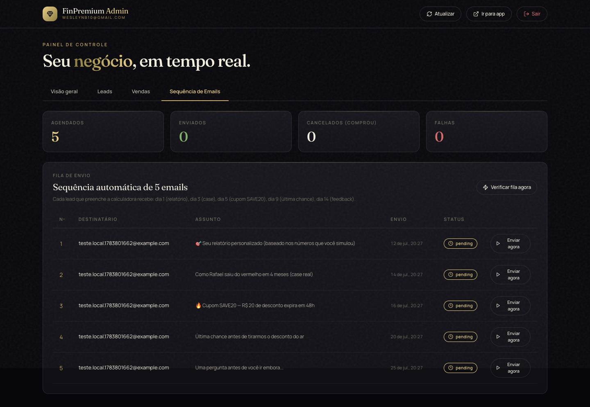

---

## 8. Sequência de e-mails (drip)

Quando alguém vira lead na calculadora, o backend agenda 5 mensagens:

| Dia | Conteúdo |
|-----|----------|
| 1 | Relatório personalizado (números da simulação) |
| 3 | Case real (Rafael, 41 anos) |
| 5 | Cupom **SAVE20** (R$ 77 em vez de R$ 97, 48h) |
| 9 | Última chance |
| 14 | Pesquisa “o que faltou” |

- Worker asyncio a cada **60s** (`drip_service.py` → coleção `email_queue`).
- Se o lead **compra**, todos os pending viram `cancelled` (via status checkout **e** webhook).
- Envio real depende de `RESEND_API_KEY` no `.env`.

---

## 9. API backend

Base: `http://127.0.0.1:8000/api`

| Método | Endpoint | Auth | Função |
|--------|----------|------|--------|
| GET | `/packages` | — | Lista pacotes |
| POST | `/leads` | — | Captura lead + agenda drip |
| GET | `/leads/count` | — | Contagem de leads |
| POST | `/checkout/session` | — | Cria sessão Stripe |
| GET | `/checkout/status/{id}` | — | Status pagamento |
| POST | `/webhook/stripe` | Stripe sig | Webhook |
| POST | `/auth/login` | — | Login admin |
| POST | `/auth/logout` | cookie | Logout |
| GET | `/auth/me` | cookie | Usuário atual |
| GET | `/admin/dashboard` | admin | KPIs |
| GET | `/admin/leads` | admin | Lista leads |
| GET | `/admin/transactions` | admin | Vendas |
| GET | `/admin/drip` | admin | Fila drip |
| POST | `/admin/drip/fire-next` | admin | Envia próximo e-mail do lead |
| POST | `/admin/drip/run-now` | admin | Processa fila agora |
| POST | `/test/email` | — | E-mail de teste (owner) |

Swagger interativo: http://127.0.0.1:8000/docs

---

## 10. Design system

| Token | HEX | Uso |
|-------|-----|-----|
| Void | `#07060A` | Fundo |
| Surface | `#131218` | Cards |
| Elevated | `#1B1A22` | Elevação |
| Line | `#2A2833` | Bordas |
| Gold | `#C9A961` | Primária |
| Gold Bright | `#E8CE87` | Destaque |
| Text | `#F5F0E1` / `#ADA79A` | Texto |
| Success / Danger | `#7FB069` / `#D46A6A` | Feedback |

- Display: **Fraunces** · Body: **Manrope** · Ícones: Lucide (stroke ~1.75)
- Componentes: `card-premium`, `btn-gold` (pill), thermometer, chips
- Sem emojis coloridos no UI do app (exceto assuntos de e-mail do drip)

---

## 11. Dados e persistência

### Frontend (localStorage)

| Chave | Conteúdo |
|-------|----------|
| `finpremium_v1` | Orçamento, dívidas, metas, etc. |
| `finpremium_leads` | Leads locais (espelho) |

### MongoDB (`finpremium`)

| Coleção | Uso |
|---------|-----|
| `users` | Admin |
| `leads` | Leads da calculadora |
| `payment_transactions` | Checkouts Stripe |
| `email_queue` | Fila do drip |
| `login_attempts` | Brute-force |
| `status_checks` | Health legado |

---

## 12. Variáveis de ambiente

### `frontend/.env`

```env
REACT_APP_BACKEND_URL=http://127.0.0.1:8000
```

### `backend/.env` (exemplo local)

```env
MONGO_URL=mongodb://127.0.0.1:27017
DB_NAME=finpremium
FRONTEND_URL=http://127.0.0.1:3000
CORS_ORIGINS=http://127.0.0.1:3000,http://localhost:3000

JWT_SECRET=<secreto>
ADMIN_EMAIL=wesleynb10@gmail.com
ADMIN_PASSWORD=FinPremium2026!
COOKIE_SECURE=false

RESEND_API_KEY=          # cole a chave para e-mails reais
SENDER_EMAIL=onboarding@resend.dev
OWNER_EMAIL=wesleynb10@gmail.com

STRIPE_API_KEY=          # checkout real + pacote emergentintegrations
```

Arquivos `.env` estão no `.gitignore`.

---

## 13. Credenciais locais

| Item | Valor |
|------|-------|
| Admin URL | http://127.0.0.1:3000/admin/login |
| E-mail | `wesleynb10@gmail.com` |
| Senha | `FinPremium2026!` |

---

## 14. Status das integrações

| Integração | Local | Observação |
|------------|-------|------------|
| UI / rotas / admin / drip (fila) | ✅ Ativo | Código v1.5 completo |
| MongoDB | ✅ Ativo | Leads, fila, admin |
| Auth JWT + cookies HTTP | ✅ Ativo | `COOKIE_SECURE=false` no local |
| Resend (e-mail) | ⚠️ Pendente | Sem `RESEND_API_KEY` → fila agenda, não envia |
| Stripe checkout | ⚠️ Stub | Pacote `emergentintegrations` privado; precisa chave + pacote real |
| Preview Emergent (`wealth-control-25`) | ⏸ Cloud | Sessão parou por créditos; app local é independente |

---

## 15. Histórico de versões

| Versão | Entrega |
|--------|---------|
| **v1.0** | Dashboard, orçamento, dívidas, metas, bônus, escopo |
| **v1.1** | CSV import, calculadora pública, Share Story |
| **v1.2** | Landing `/venda`, Stripe, `/obrigado`, leads no Mongo |
| **v1.3** | Autoresponder Resend (welcome + notify owner) |
| **v1.4** | Admin JWT, KPIs, leads/vendas, brute-force |
| **v1.5** | Drip 5 e-mails, worker, aba Sequência, cancelamento na compra |

Testes reportados na v1.5: **33/33 backend** + fluxo frontend E2E (ver `test_reports/iteration_5.json`).

---

## Anexos

- Escopo de produto: [`../FinPremium_Escopo_Completo.md`](../FinPremium_Escopo_Completo.md)
- PRD vivo: [`../memory/PRD.md`](../memory/PRD.md)
- Prints desta doc: pasta [`screenshots/`](screenshots/)

---

*Documento gerado em 11/07/2026 a partir do ambiente local FinPremium v1.5.*
