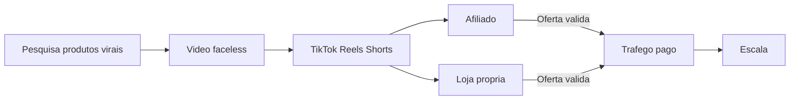

# Faceless Viral Commerce — Modelo de Negócio + Playbook Operacional

Playbook para operar uma máquina de conteúdo **faceless** sobre produtos virais, monetizando em 3 frentes: afiliados → loja/dropshipping → tráfego pago. Sem aparecer na câmera.

---

## 1. Tese do negócio

Transformar produtos com prova social (já viralizando) em vídeos curtos de alta retenção e capturar dinheiro em camadas:

1. **Afiliados** — cash rápido e validação de oferta
2. **Loja / dropshipping** — margem maior no que já converteu
3. **Tráfego pago** — escala o que o orgânico já provou

Formato faceless: voz IA, texto on-screen, B-roll, UGC licenciado, demos de produto (mãos/produto, sem rosto).

**Regra de ouro:** orgânico valida → afiliado monetiza cedo → loja captura margem → ads só no que já vendeu.



---

## 2. Modelo de receita (3 frentes)

| Frente | Quando usar | Margem típica | Complexidade |
|--------|-------------|---------------|--------------|
| Afiliado (Shopee, Amazon, Hotmart, ClickBank, Magalu) | Dia 1 — validar produto/ângulo | 5–30% comissão | Baixa |
| Loja / dropshipping (Shopify/Nuvemshop + CJ/Ali/nacional) | Após 1+ vídeo com CTR/conversão | 30–60% | Média |
| Tráfego pago (Meta/TikTok Ads) | Só ofertas com sinal orgânico positivo | Variável | Alta |

### Como as frentes trabalham juntas

| Estágio | Ação | Objetivo |
|---------|------|----------|
| Semanas 1–2 | Só afiliado, 1 oferta na bio | 1ª venda via vídeo |
| Semanas 3–4 | Abrir loja no produto validado | Subir margem |
| Semana 5+ | Ads nos criativos top 10% | Escala controlada |

Não rode as três frentes com o mesmo peso no dia 1. Sequência: validar barato → capturar margem → escalar com dinheiro.

---

## 3. Nicho e posicionamento

**Ângulo padrão:** produtos virais que resolvem dor real.

Clusters recomendados (escolher **um** no início):

- Utilidade doméstica / organização
- Beleza gadget
- Fitness gadget
- Pet
- Tech barato / acessórios

**Evitar:** suplementos regulados sem base, saúde médica, finanças, conteúdo adulto, claims milagrosos.

**Marca faceless:** 1 página/marca por cluster. Não misturar 20 nichos na mesma conta no começo.

Exemplo de identidade mínima:

- Nome curto + nicho óbvio (ex.: “Casa em 1 Minuto”)
- Bio com 1 frase de valor + link único
- Visual consistente (fonte, cor de texto on-screen, ritmo de corte)

---

## 4. Scorecard de produto (0–10)

Só avançar para produção se **score total ≥ 7**.

| Critério | Peso | 0 | 1 | 2 |
|----------|------|---|---|---|
| Hook visual em 1s (antes/depois, transformação, satisfying) | 2 | Fraco / precisa explicação | Médio | Instantâneo |
| Preço impulso (faixa R$30–150 ou equivalente) | 2 | Fora da faixa / fricção alta | Limítrofe | Ideal |
| Problema claro + solução óbvia no vídeo | 2 | Confuso | Parcial | Cristalino |
| Economia (afiliado ≥10% **ou** dropship viável) | 2 | Não fecha | Apertado | Saudável |
| Prova social real (não hype vazio) | 2 | Fake / zero sinal | Alguns sinais | Já viralizando com reviews |

**Fontes diárias de pesquisa (30–45 min):**

- TikTok Creative Center / sons trending + product tags
- Shopee / Amazon bestsellers + reviews recentes
- Contas afiliadas concorrentes (o que está saturando)
- Google Trends + buscas “viral products [mês]”

**Quem escolhe:** o **Researcher** (papel dedicado — não o closer). Entrega diária: 1–2 produtos com score ≥7 + ficha preenchida + link afiliado. O Closer só veta por compliance/margem; não pesquisa.

**Template de registro (copiar por produto):**

```
Produto:
Fonte:
Preço:
Comissão / custo dropship:
Score (0–10):
Hook visual (1 frase):
Dor que resolve:
Link afiliado / fornecedor:
Researcher:
Decisão: PRODUZIR / ARQUIVAR
```

---

## 5. Produção faceless (pipeline)

### Formato vencedor (15–30s)

1. **0–1s** — hook visual + texto (“Isso resolve X em 10 segundos”)
2. **1–8s** — demo do produto (mãos/produto)
3. **8–20s** — 2–3 benefícios / prova (número, “antes”, review curto)
4. **CTA** — “link na bio” / “comenta EU QUERO” / código

### Stack

| Etapa | Ferramenta |
|-------|------------|
| Edição | CapCut (templates + texto animado) |
| Voz | CapCut TTS ou ElevenLabs (PT-BR) |
| Footage | Demo própria (amostra) **ou** UGC licenciado / stock + overlays |
| Áudio | Som trending (volume baixo sob a voz) |
| Agendamento | CapCut / Meta Business Suite / Postiz / Late |

### Volume inicial (TikTok-first)

- **Fase 0 (semanas 1–2):** só TikTok — **3–5 vídeos/dia × 2 contas TikTok = 6–10 posts/dia**
- Reels e Shorts entram só depois de 1 sinal claro no TikTok (views + cliques ou venda)
- **1 produto = 5–10 ângulos/hooks** (nunca um único vídeo)

---

## 6. Templates de roteiro (5 hooks)

Use o mesmo produto; troque só o gancho. Preencha `[PRODUTO]`, `[DOR]`, `[RESULTADO]`.

### Hook 1 — Problema imediato

```
[VOZ/TEXTO] Pare de sofrer com [DOR].
[DEMO] Olha o [PRODUTO] resolvendo em segundos.
[BENEFÍCIO] Sem esforço. Sem bagunça. Resultado na hora.
[CTA] Link na bio — comenta EU QUERO.
```

### Hook 2 — Antes / depois

```
[VISUAL] Antes: [cena da dor]. Depois: [cena resolvida].
[VOZ] O [PRODUTO] virou o atalho que eu queria.
[PROVA] Em menos de 10 segundos muda o jogo.
[CTA] Tá no link da bio.
```

### Hook 3 — “Ninguém te conta”

```
[TEXTO] O produto viral que resolve [DOR] de verdade.
[DEMO] Encaixa / liga / usa — pronto.
[LISTA] 1) rápido  2) barato  3) cabe no dia a dia
[CTA] Corre no link da bio antes de esgotar o hype.
```

### Hook 4 — Satisfying / ASMR visual

```
[VISUAL] Loop satisfying do [PRODUTO] nos primeiros 1s.
[VOZ] Isso vicia. E ainda resolve [DOR].
[BENEFÍCIO] Você usa uma vez e não volta atrás.
[CTA] Link na bio. Salva esse vídeo.
```

### Hook 5 — Prova social / “todo mundo pedindo”

```
[TEXTO] Por que esse [PRODUTO] tá em todo lugar?
[DEMO] Porque resolve [DOR] sem drama.
[PROVA] Reviews + uso real em 15 segundos.
[CTA] Comenta LINK que eu te mando / link na bio.
```

**Checklist rápido pré-export:**

- [ ] Hook legível sem som
- [ ] Rosto nunca aparece
- [ ] CTA único e claro
- [ ] Duração 15–30s
- [ ] Divulgação de afiliado quando aplicável (`#publi` / “link afiliado”)

---

## 7. Distribuição (TikTok-first)

**Prioridade no início: 100% TikTok.** Não abrir Reels/Shorts até o TikTok validar oferta.

| Fase | Plataforma | Papel |
|------|------------|-------|
| Agora (semanas 1–4) | **TikTok only** | Descoberta + validação de produto |
| Depois do 1º sinal | Instagram Reels | Mesmo corte; bio com link |
| Depois | YouTube Shorts | Longtail + monetização depois |

**Contas iniciais:** 2 páginas faceless **só no TikTok**, mesmo cluster. Captions nativas; variar hooks entre contas.

**Link-in-bio / TikTok:** link na bio (quando liberado) ou CTA “comenta EU QUERO” + DM/link — **1 oferta por vez** (afiliado primeiro; depois loja).

**Ads iniciais:** TikTok Ads primeiro; Meta Ads só após loja + pixel estáveis.

---

## 8. Rotina diária e semanal

### Diária (papéis separados)

| Bloco | Tempo | Dono | Tarefa |
|-------|-------|------|--------|
| A — Pesquisa | 30–45 min | **Researcher** | Scorecard em 5–10 produtos; entregar 1–2 ≥7 |
| B — Roteiro | 20–30 min | Editor / Closer | 5 hooks para o produto aprovado |
| C — Edição | 60–90 min | Editor | Batch CapCut (3–5 cuts) |
| D — Post TikTok + engajamento | 20–30 min | Poster | Postar nas 2 contas TikTok, responder CTA, fixar comentário |
| E — Tracking | 10 min | Closer | Anotar views, retenção, cliques, vendas |

Handoff Researcher → produção: ficha do produto no chat/planilha até **10h** (ou horário fixo do time). Sem ficha, não edita.

### Semanal

- Researcher: pipeline de 7–14 produtos ranqueados para a semana seguinte
- Revisar top 10% de criativos **no TikTok** (retenção + cliques)
- Matar produtos sem sinal (ver critérios kill)
- Atualizar bio/CTA para a oferta vencedora
- Pedir amostra / cotar dropship do que vendeu
- Backup de contas + planilha de UTMs
- Só então avaliar crosspost para Reels

---

## 9. Setup checklists

### 9.1 Afiliados (Semanas 1–2)

- [ ] Conta Shopee Afiliados aprovada
- [ ] Segunda rede cadastrada (Amazon Assoc. / Magalu / Hotmart — conforme nicho)
- [ ] Link de afiliado testado (compra teste ou preview)
- [ ] Divulgação clara nos vídeos/bio (`#publi` / “conteúdo com link afiliado”)
- [ ] Bio com **1** oferta ativa
- [ ] Planilha: `data | conta | produto | link | views | cliques | vendas | comissão`
- [ ] Meta da fase: ≥1 venda atribuída a vídeo

### 9.2 Loja / dropshipping (Semanas 3–4 — só produto validado)

- [ ] Shopify ou Nuvemshop criada
- [ ] Fornecedor escolhido (CJ / AliExpress / nacional) + prazo realista
- [ ] Amostra física pedida e filmada (quando possível)
- [ ] Página de produto com prova (fotos reais / demo)
- [ ] Frete e prazo honestos no checkout
- [ ] Pixel Meta + TikTok Pixel instalados
- [ ] UTMs desde o dia 1 (`utm_source=tiktok&utm_medium=organic&utm_campaign=produto_x`)
- [ ] Política de troca/reembolso publicada
- [ ] Criativo orgânico vencedor reaproveitado como criativo da loja

### 9.3 Tráfego pago (Semana 5+ — só com vendas reais)

- [ ] Business Manager / TikTok Ads Manager verificados
- [ ] Pixel disparando Purchase / InitiateCheckout
- [ ] Whitelist: só criativos no top 10% de views/retenção orgânica
- [ ] Orçamento inicial: R$30–50/dia **por criativo**
- [ ] Meta de CPA definida (= &lt;30–40% da margem)
- [ ] Kill rule: matar criativo em 48h se CPA &gt; meta sem sinal
- [ ] Separar campanhas: teste criativo vs. escala
- [ ] Não escalar oferta sem pelo menos 1 venda orgânica prévia (regra deste playbook)

---

## 10. KPIs e critérios kill / scale

### KPIs

| Métrica | Alvo inicial |
|---------|----------------|
| Views/vídeo (mediana) | Tendência crescente (não 1 viral isolado) |
| Retenção 3s | &gt;70% |
| Watch % médio | &gt;40% em vídeos 15–25s |
| CTR bio / comentário CTA | &gt;1–2% dos views engajados |
| Conversão oferta | ≥1–2% do clique |
| CPA ads | &lt;30–40% da margem |

### Kill (parar produto / ângulo)

Mate o produto se, após **10 vídeos × 3 ângulos** (≥30 posts no cluster):

- Views consistentemente frias **e**
- Zero cliques na bio / zero vendas

Mate o criativo pago se:

- 48h com gasto ≥2× CPA alvo e zero conversão, ou
- CPA acima da meta sem tendência de queda

### Scale (dobrar aposta)

- Orgânico: 5–10 novos hooks do **mesmo** produto vencedor
- Loja: migrar afiliado → SKU próprio no produto que já vendeu
- Ads: aumentar verba só em criativos com CPA estável por 3+ dias
- Contas: abrir 2ª página no **mesmo** cluster (não nicho novo)

---

## 11. Estrutura de time mínimo

| Papel | Função | Quem |
|-------|--------|------|
| **Researcher** | Pesquisa, scorecard, decisão PRODUZIR/ARQUIVAR, fila semanal de produtos | **Papel dedicado (contratar / VA)** |
| Editor | CapCut batch a partir da ficha do Researcher | VA / você |
| Poster | Postar no TikTok + comentar CTA | VA / você |
| Closer | Afiliados, loja, TikTok Ads, veto de compliance/margem | Você |

**Researcher — SLA diário:**

- Analisar 5–10 produtos (TikTok Creative Center + Shopee/Amazon)
- Entregar 1–2 fichas com score ≥7
- Incluir: hook visual, dor, link afiliado, preço, score
- Não edita vídeo e não gerencia ads

**Você (Closer):** ofertas, bio, tracking, loja e ads. Não escolhe produto no dia a dia.

**Escalada:** VA de edição + batch semanal de 50–100 cuts. Researcher continua dono da seleção.

---

## 12. Riscos e compliance

- **CONAR / transparência:** sempre sinalizar afiliado (`#publi`, “link afiliado”)
- **Claims:** não inventar benefícios médicos ou milagrosos
- **Direitos de imagem:** não reutilizar UGC sem licença; priorizar demo própria ou stock
- **Spam / ban:** variar hooks, contas e ritmo; evitar flood idêntico
- **Dropshipping:** prazos e qualidade — começar com amostra antes de ads pesados
- **Plataformas:** respeitar regras de TikTok Shop / links externos por região

---

## 13. Stack de ferramentas (referência)

| Necessidade | Opções |
|-------------|--------|
| Pesquisa | TikTok Creative Center, Shopee, Amazon, Google Trends |
| Edição / voz | CapCut, ElevenLabs |
| Bio | Linktree, Beacons, Stan |
| Loja | Shopify, Nuvemshop |
| Fornecedor | CJDropshipping, AliExpress, fornecedor nacional |
| Ads | Meta Ads, TikTok Ads |
| Tracking | Planilha + UTMs + pixels; depois: sistema fase 2 |

---

## 14. Fase 2 — Spec do sistema automatizado

Quando o playbook estiver rodando manualmente por ≥2 semanas, construir um sistema (app no repo) com os módulos abaixo.

### 14.1 Objetivos

- Acelerar pesquisa → roteiro → fila de produção → postagem TikTok → atribuição de receita
- **Researcher** no loop para score final; Closer no loop para aprovação de ads

### 14.2 Módulos

| Módulo | Input | Output |
|--------|-------|--------|
| **Ingestão de trends/produtos** | APIs/scrapes manuais + CSV de produtos quentes | Lista ranqueada com score preliminar |
| **Scorecard assistido** | Campos do produto | Score 0–10 + decisão PRODUZIR/ARQUIVAR |
| **Geração de roteiros** | Produto + dor + benefícios | 5 hooks no formato da seção 6 |
| **Fila de produção** | Roteiros aprovados | Cards: status `roteiro → edição → pronto → postado` |
| **Postagem / checklist** | Vídeo pronto + contas | Checklist de upload + captions sugeridas (postagem 100% auto só se API disponível e estável) |
| **Tracking** | UTMs + pixels + comissões | `vídeo → oferta → cliques → receita` por frente (afiliado/loja/ads) |
| **Kill/scale alerts** | KPIs da seção 10 | Alertas: matar produto, escalar criativo, migrar para loja |

### 14.3 Dados mínimos (modelo)

```
Product: id, name, niche, price, affiliate_url, supplier_url, score, status
Script: id, product_id, hook_type, body, status
Asset: id, script_id, file_url, duration_s, status
Post: id, asset_id, platform, account, posted_at, views, retention_3s, watch_pct, ctr
Conversion: id, post_id, offer_type[affiliate|store|ads], clicks, orders, revenue, cpa
```

### 14.4 MVP técnico sugerido

1. Backend simples (API + DB) para products/scripts/posts/conversions
2. UI mínima: scorecard + fila Kanban + dashboard de KPIs
3. Geração de roteiros via LLM com prompt fixo dos 5 hooks
4. Import CSV de métricas (enquanto APIs oficiais forem limitadas)
5. Export de checklist diário

### 14.5 Fora de escopo do MVP

- Scraping agressivo que viole ToS
- Auto-post sem revisão humana no dia 1
- Claims gerados sem filtro de compliance
- Escala de ads sem aprovação manual

### 14.6 Critério para iniciar fase 2

- [ ] Playbook manual rodando
- [ ] ≥1 produto com venda atribuída
- [ ] Planilha de tracking preenchida por ≥14 dias
- [ ] 1 cluster de nicho estável

---

## 15. Arranque em 48 horas

1. Contratar / briefing do **Researcher** (SLA + template de ficha + scorecard)
2. Escolher **1 cluster** de nicho e criar **2 contas faceless só no TikTok**
3. Cadastrar Shopee Afiliados (+ 1 rede)
4. Researcher: scorecard em 10 produtos → liberar os 2 melhores
5. 5 hooks × 2 produtos = 10 vídeos → postar **apenas no TikTok**
6. Bio/CTA com 1 link; planilha de tracking aberta
7. Poster responde CTA; repetir amanhã

Não abrir Reels/Shorts, loja nem ads antes da primeira venda orgânica/afiliada no TikTok.
